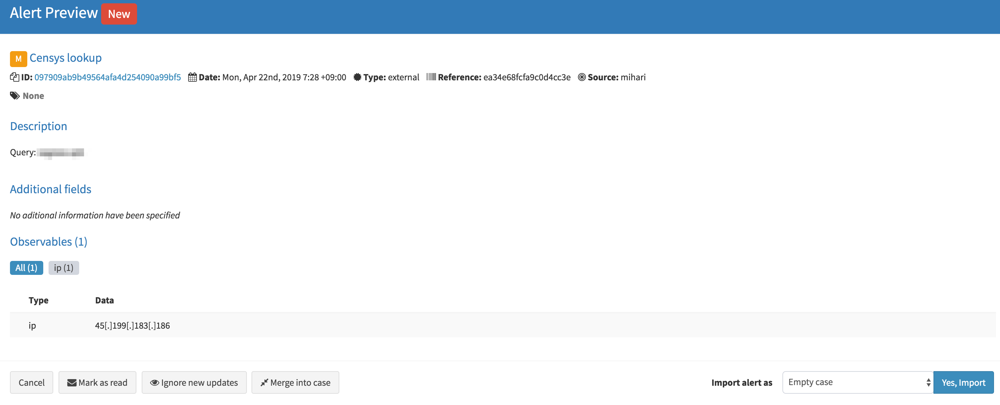

# mihari

[](https://badge.fury.io/rb/mihari)
[](https://travis-ci.org/ninoseki/mihari)
[](https://coveralls.io/github/ninoseki/mihari?branch=master)
[](https://www.codefactor.io/repository/github/ninoseki/mihari)

mihari(`見張り`) is a sidekick tool for [TheHive](https://github.com/TheHive-Project/TheHive) to monitor malicious hosts (C2 / landing page / phishing, etc.) continuously.

## How it works

- mihari checks whether a TheHive instance contains given artifacts or not.
  - If it doesn't contain the artifacts:
    - mihari creates an alert with the artifacts on the TheHive instance.
    - mihari sends a notification to Slack. (Optional)

Check this blog post for more detail: [Continuous C2 hunting with Censys, Shodan, Onyphe and TheHive](https://hackmd.io/s/SkUaSrqoE)

### Screenshots

- TheHive alert example



- Slack notification example


## Installation

```bash
gem install mihari
```

## Basic usage

mihari supports Censys, Shodan and Onyphe by default.

```bash
$ mihari
Commands:
  mihari censys [QUERY]    # Censys IPv4 lookup by a given query
  mihari help [COMMAND]    # Describe available commands or one specific command
  mihari import_from_json  # Give a JSON input via STDIN
  mihari onyphe [QUERY]    # Onyphe datascan lookup by a given query
  mihari shodan [QUERY]    # Shodan host lookup by a given query
  mihari urlscan [QUERY]   # urlscan lookup by a given query
```

### Censys

```bash
mihari censys "YOUR_QUERY"
```

### Shodan

```bash
mihari shodan "YOUR QUERY"
```

### Onyphe

```bash
mihari onyphe "YOUR QUERY"
```

### urlscan.io

```bash
mihari urlscan "YOUR QUERY"
```

### Import from JSON

```bash
echo '{ "title": "test", "description": "test", "artifacts": ["1.1.1.1", "github.com", "2.2.2.2"] }' | mihari import_from_json
```

The input is a JSON data should have `title`, `description` and `artifacts` key. `tags` key is an optional parameter.

```json
{
  "title": "test",
  "description": "test",
  "artifacts": ["1.1.1.1", "github.com"],
  "tags": ["test"]
}
```

| Key         | Desc.                                                                      | Required or optional |
|-------------|----------------------------------------------------------------------------|----------------------|
| title       | A title of an alert                                                        | Required             |
| description | A description of an alert                                                  | Required             |
| artifacts   | An array of artifacts (supported data types: ip, domain, url, email, hash) | Required             |
| tags        | An array of tags                                                           | Optional             |

## Configuration

All configuration is done via ENV variables.

| Key                  | Desc.              | Required or optional           |
|----------------------|--------------------|--------------------------------|
| THEHIVE_API_ENDPOINT | TheHive URL        | Required                       |
| THEHIVE_API_KEY      | TheHive API key    | Required                       |
| SLACK_WEBHOOK_URL    | Slack Webhook URL  | Optional                       |
| SLACK_CHANNEL        | Slack channel name | Optional (default: `#general`) |
| CENSYS_ID            | Censys API ID      | Optional                       |
| CENSYS_SECRET        | Censys secret      | Optional                       |
| SHODAN_API_KEY       | Shodan API key     | Optional                       |
| ONYPHE_API_KEY       | Onyphe API key     | Optional                       |

## How to create a custom analyzer

Create a class which extends `Mihari::Analyzers::Base` and implements the following methods.

| Name           | Desc.                                                                      | @return       | Required or optional |
|----------------|----------------------------------------------------------------------------|---------------|----------------------|
| `#title`       | A title of an alert                                                        | String        | Required             |
| `#description` | A description of an alert                                                  | String        | Required             |
| `#artifacts`   | An array of artifacts (supported data types: ip, domain, url, email, hash) | Array<String> | Required             |
| `#tags`        | An array of tags                                                           | Array<String> | Optional             |

```ruby
require "mihari"

module Mihari
  module Analyzers
    class Example < Base
      def title
        "example"
      end

      def description
        "example"
      end

      def artifacts
        ["9.9.9.9", "example.com"]
      end

      def tags
        ["example"]
      end
    end
  end
end

example = Mihari::Analyzers::Example.new
example.run
```

See `/examples` for more.

## License

The gem is available as open source under the terms of the [MIT License](https://opensource.org/licenses/MIT).
