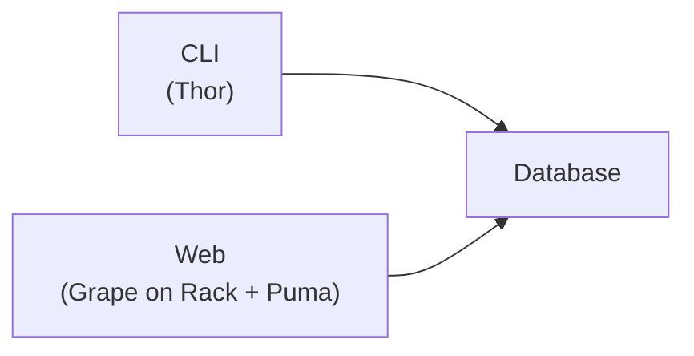
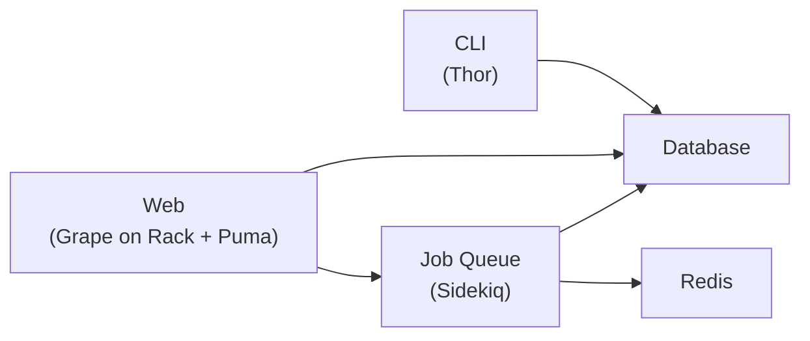

# Architecture

Mihari uses following components:

- [rails/thor](https://github.com/rails/thor) for building the CLI application
- [ruby-grape/grape](https://github.com/ruby-grape/grape), [rack/rack](https://github.com/rack/rack) and [puma/puma](https://github.com/puma/puma) for building and running the web application
- [sidekiq/sidekiq](https://github.com/sidekiq/sidekiq) for (optional) background processing
- [vuejs](https://github.com/vuejs/) for building the frontend SPA

## Basic

## Advanced

This one is recommended if you want to use the API a lot.

Sidekiq handles time-consuming jobs such as searching a rule, etc.

!!! note

    The web application runs on Rack + Puma. Its default HTTP request timeout is 60s. It means that a search exceeds 60s will fail.
