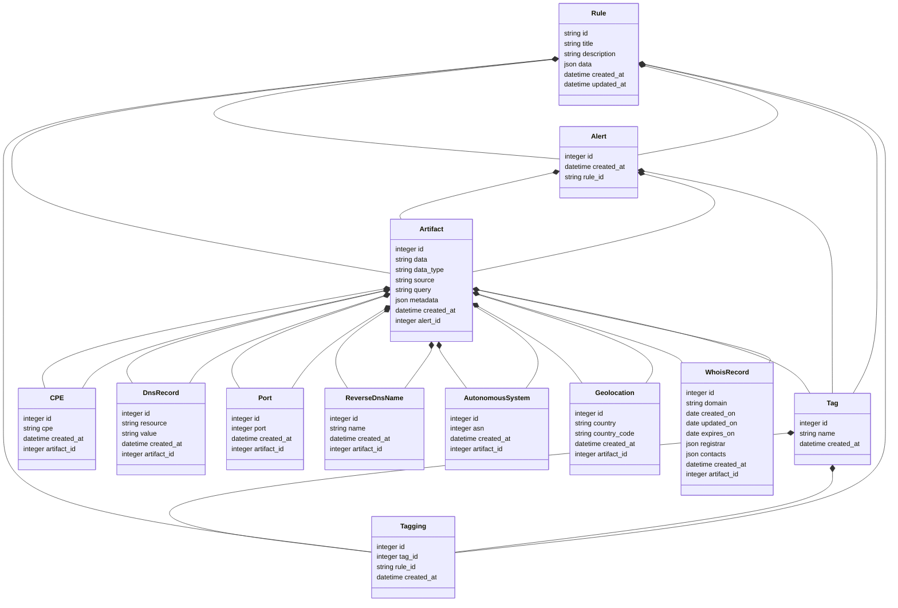
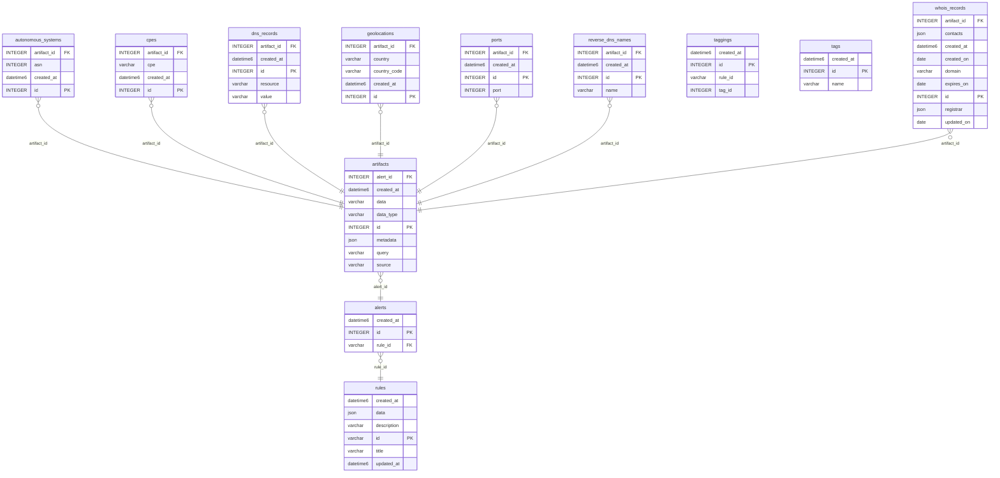

# Diagrams

## ActiveModel Class Diagram

```mermaid
classDiagram
  class Rule {
    string id
    string title
    string description
    json data
    datetime created_at
    datetime updated_at
  }
  Rule *-- Alert
  Rule *-- Tagging
  Rule *-- Tag

  class Alert {
    integer id
    datetime created_at
    string rule_id
  }
  Alert --* Rule
  Alert *-- Artifact
  Alert *-- Tag

  class Artifact {
    integer id
    string data
    string data_type
    string source
    string query
    json metadata
    datetime created_at
    integer alert_id
  }
  Artifact --* Alert
  Artifact *-- CPE
  Artifact *-- DnsRecord
  Artifact *-- Port
  Artifact *-- ReverseDnsName
  Artifact *-- Tag
  Artifact -- AutonomousSystem
  Artifact -- Geolocation
  Artifact -- WhoisRecord
  Artifact -- Rule

  class AutonomousSystem {
    integer id
    integer asn
    datetime created_at
    integer artifact_id
  }
  AutonomousSystem --* Artifact

  class Port {
    integer id
    integer port
    datetime created_at
    integer artifact_id
  }
  Port --* Artifact

  class CPE {
    integer id
    string cpe
    datetime created_at
    integer artifact_id
  }
  CPE --* Artifact

  class DnsRecord {
    integer id
    string resource
    string value
    datetime created_at
    integer artifact_id
  }
  DnsRecord --* Artifact

  class ReverseDnsName {
    integer id
    string name
    datetime created_at
    integer artifact_id
  }
  ReverseDnsName --* Artifact

  class WhoisRecord {
    integer id
    string domain
    date created_on
    date updated_on
    date expires_on
    json registrar
    json contacts
    datetime created_at
    integer artifact_id
  }
  WhoisRecord --* Artifact

  class Geolocation {
    integer id
    string country
    string country_code
    datetime created_at
    integer artifact_id
  }
  Geolocation --* Artifact

  class Tag {
    integer id
    string name
    datetime created_at
  }
  Tag *-- Tagging

  class Tagging {
    integer id
    integer tag_id
    string rule_id
    datetime created_at
  }
  Tagging --* Rule
  Tagging --* Tag
```

## ER Diagram

```mermaid
erDiagram
    alerts {
        datetime6 created_at
        INTEGER id PK
        varchar rule_id FK
    }

    artifacts {
        INTEGER alert_id FK
        datetime6 created_at
        varchar data
        varchar data_type
        INTEGER id PK
        json metadata
        varchar query
        varchar source
    }

    autonomous_systems {
        INTEGER artifact_id FK
        INTEGER asn
        datetime6 created_at
        INTEGER id PK
    }

    cpes {
        INTEGER artifact_id FK
        varchar cpe
        datetime6 created_at
        INTEGER id PK
    }

    dns_records {
        INTEGER artifact_id FK
        datetime6 created_at
        INTEGER id PK
        varchar resource
        varchar value
    }

    geolocations {
        INTEGER artifact_id FK
        varchar country
        varchar country_code
        datetime6 created_at
        INTEGER id PK
    }

    ports {
        INTEGER artifact_id FK
        datetime6 created_at
        INTEGER id PK
        INTEGER port
    }

    reverse_dns_names {
        INTEGER artifact_id FK
        datetime6 created_at
        INTEGER id PK
        varchar name
    }

    rules {
        datetime6 created_at
        json data
        varchar description
        varchar id PK
        varchar title
        datetime6 updated_at
    }

    taggings {
        datetime6 created_at
        INTEGER id PK
        varchar rule_id
        INTEGER tag_id
    }

    tags {
        datetime6 created_at
        INTEGER id PK
        varchar name
    }

    whois_records {
        INTEGER artifact_id FK
        json contacts
        datetime6 created_at
        date created_on
        varchar domain
        date expires_on
        INTEGER id PK
        json registrar
        date updated_on
    }

    alerts }o--|| rules : "rule_id"
    artifacts }o--|| alerts : "alert_id"
    autonomous_systems }o--|| artifacts : "artifact_id"
    cpes }o--|| artifacts : "artifact_id"
    dns_records }o--|| artifacts : "artifact_id"
    geolocations }o--|| artifacts : "artifact_id"
    ports }o--|| artifacts : "artifact_id"
    reverse_dns_names }o--|| artifacts : "artifact_id"
    whois_records }o--|| artifacts : "artifact_id"
```
