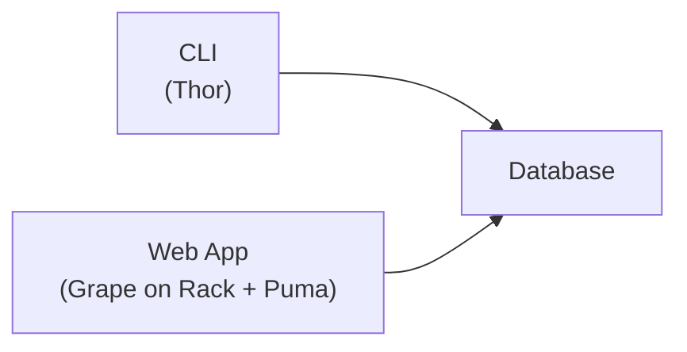
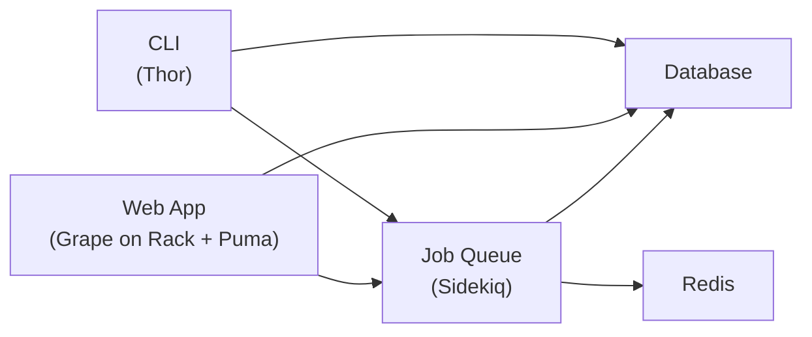

# Overview

Mihari uses following components:

- [rails/thor](https://github.com/rails/thor) for building the CLI application.
- [ruby-grape/grape](https://github.com/ruby-grape/grape), [rack/rack](https://github.com/rack/rack) and [puma/puma](https://github.com/puma/puma) for building and running the web application.
- [sidekiq/sidekiq](https://github.com/sidekiq/sidekiq) for (optional) background processing.

## Basic

## Advanced

