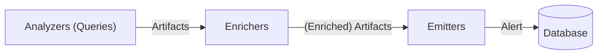

# Rule

Mihari has [Sigma](https://github.com/SigmaHQ/sigma) like format to describe a set of search queries to express a rule.

Mihari has three main components to compose a rule.



- Analyzers/Queries: a list of queries (analyzers) that builds a list of artifacts
- Enrichers: a list of enrichers that enriches a list of artifacts
- Emitters: a list of emitters that emits a list of artifacts as an alert

An artifact has five types:

- IP address (`ip`)
- Domain (`domain`)
- URL (`url`)
- Mail (`mail`)
- Hash (`hash`)

An alert can have multiple artifacts bundled by a rule.

!!! note

    A rule is assumed to be executed multiple times continuously. An alert generated by a rule will only have new findings at that time.

Let's break down the following example:

```yaml
id: c7f6968e-dbe1-4612-b0bb-8407a4fe05df
title: Example
description: Mihari rule example
created_on: "2023-01-01"
updated_on: "2023-01-02"
author: ninoseki
references:
  - https://github.com/ninoseki/mihari
related:
  - 6254bb74-5e5d-42ad-bc1e-231da0293b0f
tags:
  - foo
  - bar
queries:
  - analyzer: shodan
    query: ip:1.1.1.1
  - analyzer: censys
    query: ip:8.8.8.8
enrichers:
  - enricher: whois
  - enricher: ipinfo
  - enricher: shodan
  - enricher: google_public_dns
emitters:
  - emitter: database
  - emitter: misp
  - emitter: slack
  - emitter: thehive
data_types:
  - hash
  - ip
  - domain
  - url
  - mail
falsepositives: []
artifact_ttl: null
```

## Components

### ID

`id` (`string`) is an unique ID of a rule. UUID v4 is recommended.

### Title

`title` (`string`) is a title of a rule.

### Description

`description` (`string`) is a short description of a rule.

### Created/Updated On

`created_on` (`date`) is a date of a rule creation. Optional.
Also a rule can have `updated_on` that is a date of a rule modification. Optional.

### Tags

`tags` (`array[:string]`) is a list of tags of a rule. Optional. Defaults to `[]`.

### Author

`author` (`string`) is an author of a rule. Optional.

### References

`references` (`array[:string]`) is a list of a references of a rule. Optional.

### Related

`related` (`array[:string]`) is a list of related rule IDs. Optional.

### Queries

`queries` is a list of queries/analyzers.
See [Analyzers](./analyzers/index.md) to know details of each analyzer.

### Enrichers

`enrichers` is a list of enrichers.
See [Enrichers](./enrichers/index.md) to know details of each enricher.

Defaults to:

- `google_public_dns`
- `ipinfo`
- `shodan`
- `whois`

### Emitters

`emitters` is a list of emitters.
See [Emitters](./emitters/index.md) to know details of each emitter.

Defaults to:

- `database`

### Data Types

`data_types` (`array[:string]`) is a list of data (artifact) types to allow by a rule. Types not defined in here will be automatically rejected.

Defaults to:

- `ip`
- `domain`
- `url`
- `mail`
- `hash`

### False positives

`falsepositives` (`array[:string]`) is a list of false positive values. Optional. A string or regexp can be used in here.

For example,

```yaml
falsepositives:
  - 127.0.0.1
  - /^example\.(com|net)$/
```

rejects:

- `127.0.0.1`
- `example.com`
- `example.net`

### Artifact TTL

`artifact_ttl` (`integer`) is an integer value of artifact TTL (Time-To-Live) in seconds. Optional.

Mihari rejects a same artifact in a same rule in general.

But you may want to get a same artifact after a certain period of time. `artifact_ttl` is for that. If a rule finds a same artifact after `artifact_ttl` seconds have been passed, that artifact will be included in an alert.

## How to Run a Rule

Once you finish writing a rule, you can run the rule by `mihari` CLI.

!!! note

    You have to initialize the database by `mihari db migrate` if you haven't already done.

```bash
mihari search /path/to/rule.yml
```

The command outputs an alert to the standard output. Also you can confirm it with a built-in web app.

```bash
mihari web
```
